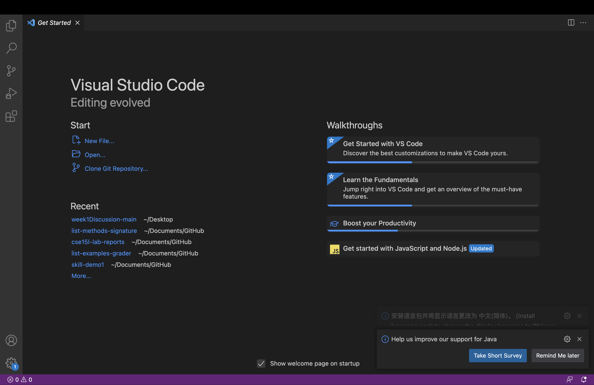
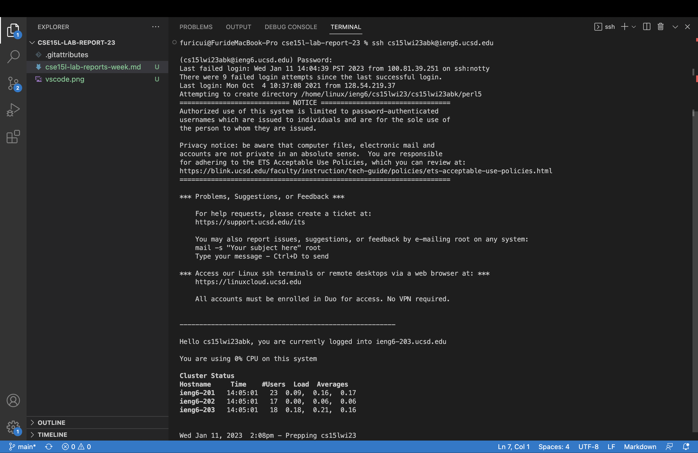
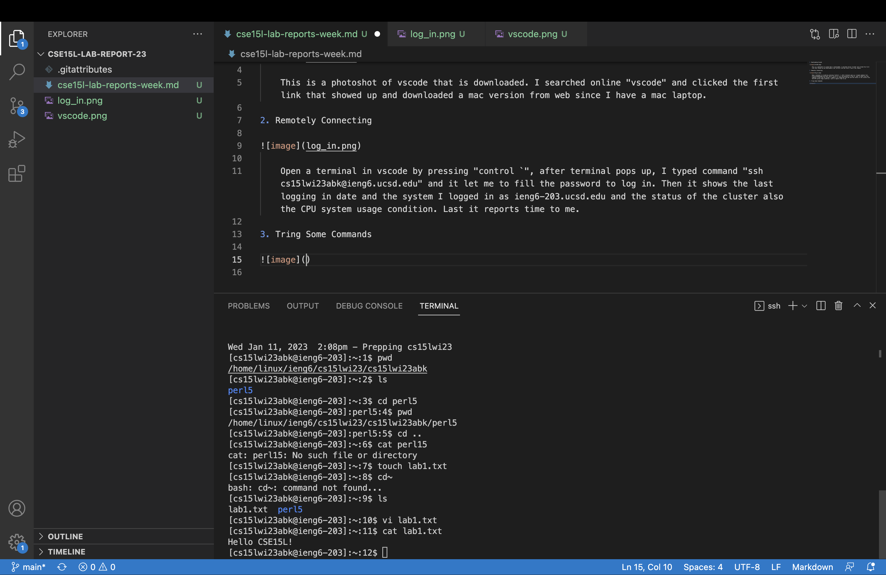

## 1. Downloading Vscode

This is a photoshot of vscode that is downloaded. I searched online "vscode" and clicked the first link that showed up and downloaded a mac version from web since I have a mac laptop.
[title](https://code.visualstudio.com/)

## 2. Remotely Connecting

First, open a terminal in vscode, after terminal pops up, I typed command `"ssh cs15lwi23abk@ieng6.ucsd.edu"` and it let me to fill the password to log in. Then it shows the last logging in date and the system I logged in as ieng6-203.ucsd.edu and the status of the cluster also the CPU system usage condition. Last it reports time to me.

## 3. Tring Some Commands

After logged in, I tried several commands in terminal. First, Printing work directory(`"pwd"`) returned an absolute path to me that tells my location. Second, `"ls"` to see all the files in my account and it returned "perl5"  which is an empty file and after I cded into it, then print working directory gives me an absolute path with perl5 at the end which indicate the location I am at. I also tried cat perl5 but there is nothing, so I created a text file called lab1.txt by using touch command. then using vim I edited the text file, typed "Hello CSE15L!". Then I cat the file it prints out what I vimed into it.
