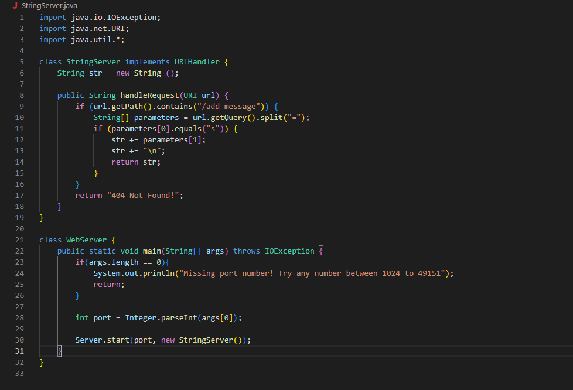
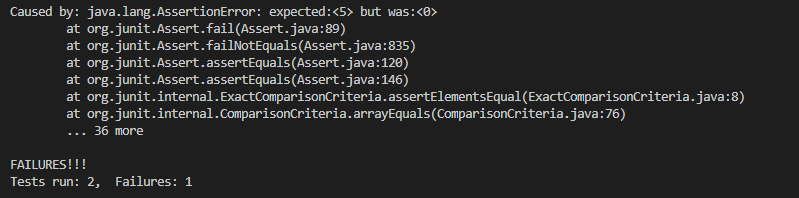

## Part 1: StringServer




This is the screenshot of the code of the StringServer. By creating a new web server, I started by writing that if the path equals to `/add-message`, it will search for `"s"`. If it exists, it return the value of the parameters as strings as users type after `"="`. otherwise, it will show `404 Not Found!` . The Web Server class is like the numberserver in lab2, it allows we to create a new webserver by typing the port after the class name in command line.


.png)


In the first example, I typed `"This is Furi"` after `"/add-message?s="`. This calls the method `handleRequest` in StringServer class. In this Method, it first looks if there exist a path `/add-message`. Then it seaarches for the string `"s"`. If they exist, the web server will return the argument we type after the `"="` as in this time: `"This is Furi"`. The value of the `String` str is changed by adding this argument, which leads to the next example.


.png)


In the second example, it is quite familiar that `"This is Furi"` showed up again. This is because the value of the `str` is stored. By using `\n` in the method `handleRequest` of StringServer class, we change the line for the new string value `"This is also Furi"` in str. We called the method `handleRequest` again by only changing the argument part of the url, which adds one more value to str in StringServer class, which becomes `"This is Furi \n This is also Furi"`.


## Part 2: Bug


I chose to view the method called `reversed` in `ArrayExamples.java`. I wrote my test in `ArrayTests.java`. The purpose of this method is to return a new array of the input array in reversed order.


Here is the `failure-inducing input`:
```
@Test
  public void testReversed_1() {
      int[] input = {1, 2, 3, 4, 5};
      assertArrayEquals(new int[]{5, 4, 3, 2, 1}, ArrayExamples.reversed(input));
  }

```

Here is the input that `doesn’t induce a failure`:
```
@Test
  public void testReversed_2() {
      int[] input = {};
      assertArrayEquals(new int[]{}, ArrayExamples.reversed(input));
  }

```

Here is the `symptom` of my failure-inducing input: The expect value is 5 at index 0, but it was 0 actually.



Here is the `bug` of the method, in the following code, the argument `arr` and `newArray` is actually in wrong place of each other. This will return `{}` forever since there is nothing inside `newArray`: 
```
static int[] reversed(int[] arr) {
    int[] newArray = new int[arr.length];
    for(int i = 0; i < arr.length; i += 1) {
      arr[i] = newArray[arr.length - i - 1];
    }
    return arr;
  }
```

To fix this code, just to switch the position of `arr` and `newArray` in the for loop and then return the `newArray` instead of `arr`:
```
static int[] reversed(int[] arr) {
    int[] newArray = new int[arr.length];
    for(int i = 0; i < arr.length; i += 1) {
      newArray[i] = arr[arr.length - i - 1];
    }
    return newArray;
  }
```


## Part 3: Lesson I learned


Finishing lab2 and 3, I accomplished tasks involving creating a new local host web server, creating new remote host web server and also writing test cases and test methods using Junit. Those activities are all the first time I have done. Creating my new own web server is very interesting to me. I can add my own path to create outputs that varies considering my input. Also I learned that there are many bugs in method hard to find out by only looking at them. By first testing them, it is much easier to find out where the bug is and can thus fix the bug to make the purpose of the method fulfilled.