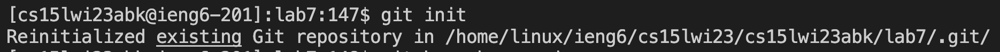

## 1. (Setup) Delete any existing forks of the repository you have on your account

First: Open lab7 repository in github.com.

Second: Click Settings.

Third: Scroll to the end and "Delete this repository"

## 2. (Setup) Fork the repository

First: Click this website:https://github.com/ucsd-cse15l-w23/lab7 and click "fork" on rightmost upper corner.

Second: Click "Create Fork".

## 3. Log into ieng6

First: Create a new terminal.

Second: Type:`ssh cs15lwi23abk@ieng6.ucsd.edu` in the command bar to log in to my ieng6 account.Here you can see that I do not need to enter my password again because of keygen.

## 4. Clone your fork of the repository from your Github account

First: Click "Code", and Copy the "SSH" link.

Second: Type:`git clone git@github.com:FuriCui/lab7.git` to clone the fork of my own repository.

## 5. Run the tests, demonstrating that they fail

First: Type:`cd lab7` to change my working directory to lab7.

Second: Type: `vim t.sh` to create a bash script file that is called "t.sh".

Third: Press `i` to be in insert mode. Copy and paste the commands from our class website by pressing `command-c` to copy and `command-v` to paste. Then, press `:wq` to save the file and exit.

Fourth: Type: `bash t.sh` to run the script as commands, then we have 1 failure as shown.

## 6. Edit the code file to fix the failing test

First: Type: `vim ListExamples.java` to open ListExamples in vim mode for us to fix the bug.

Second: Press `J` as many times as needed to where this picture shows, then press `l`, which moves to right by one space, enough times to reach where 43,13 showned at the rightend corner. Press `i` to get into the insert mode. Press `delete` to delete "1" and then press `2`. Then we have fixed the bug where this caused the while loop to run infinitely. Then press `esc` to get out of insert mode and press `:wq` to save and exit.

## 7. Run the tests, demonstrating that they now succeed

First: Type: `bash t.sh` to run the tests. and we can see they pass now.

## 8. Commit and push the resulting change to your Github account

First: Type: `git init` to initialize the git repository.

Second: Type: `git branch -m main` to create my main branch. Then press `<enter>`, Type: `git add ListExamples.java` to add the changed file to github. Then pressing `<enter>`, Type: `git commit -m "new ListExamples"` to commit the changes to the repository I have right now.

Thir: Type: `git push` to push everything into my repository.

Fourth: As we can see now, it is pushed to the my own repository
